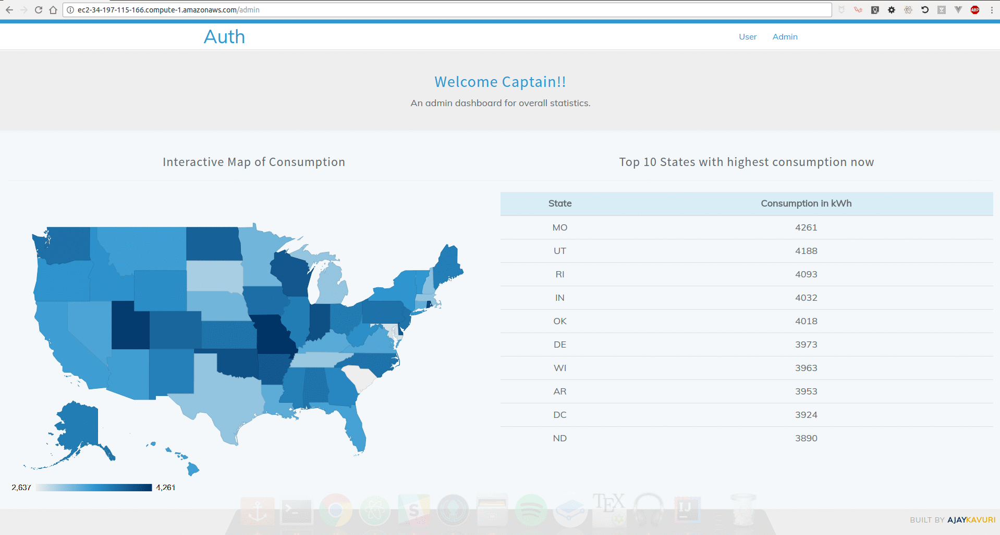

> AUTH: Analytics of Utility Things is a platform for ingesting, processing and extracting insights from next billion connected Internet of Things (IoT).

| [](https://travis-ci.org/PseudoAj/MyInsightRepo) | [](https://github.com/pseudoaj/MyInsightRepo) | Presentation: [slides](http://authslides.pseudoaj.com)  | Demo: [auth.pseudoaj.com](http://auth.pseudoaj.com) | Contact: [linkedin](https://www.linkedin.com/in/pseudoaj) |
|----------|----------------|--------|-----------|-----------|

<hr/>

## About

With the advent of Internet of Things (IoT), traditional systems are being replaced with smart systems that can speak with cloud in real-time but there is a engineering problem: How can I **ingest** this information with high **velocity** from **variety** of sensors and extract **accurate** insights at **scale** with **fault tolerance**? This project attempts to solve this problem.

**Wouldn't it be nice if you can see your home utilization like this?**


**Or wouldn't it be cool for a company to monitor country utilization like this?**



## Data Pipeline


## Technical Stack

| **#**| **Technology**   | **Language** | **Purpose**              |
|---|--------------|----------|----------------------|
| 1 | `Apache Kafka` `0.9.0.1` | `Python` `2.7`   | Ingestion            |
| 2 | `Apache Flink` `1.1.4`| `Java` `1.8`     | Stream Processing    |
| 3 | `Redis` `3.2.6`       | `Java` `1.8` `PHP` `7.0` | Key/Value Cache      |
| 4 | `Amazon S3`    | N/A      | Distributed Storage  |
| 5 | `Apache Spark` `2.1.0`  | `Python` `2.7`   | Batch Processing     |
| 6 | `MySQL`        | `SQL`      | Application Database |
| 7 | `Laravel` `5.4`      | `PHP` `7.0`      | Web Framework        |
| 8 | `Amazon AWS`   | `BASH`     | Devops               |

## Directory Structure

```
+ data       : scripts that are used to generate and manipulate data
  + examples : scripts that I wrote to understand basics
  + output   : data generated for testing purposes and also stores some temporary pickle files
  + S3       : scripts that help generate batch data and upload to Amazon S3
  + src      : scripts for testing data generation logic
  + stream   : scripts for simulating streaming data
+ flink      : contains executable jars and source files for stream processing
+ laravel    : project directory for MVC framework
+ misc       : some configurations, backups and helper files
+ setup      : bunch of bash scripts that help automate production
```

## 1. Simulating Data

The idea is to create as realistic dataset as possible; hence the dataset is inspired from real world frameworks and smart meters. Data consists of `8 Miliion` users including residential and business utility installations, this data is saved as `dictionaries` using `pickle` files along with meta data. Each user is assigned with a random starting time for sending information and sensors communicate with heartbeat of `5 seconds`. A batch data of size `1.8 TB` is simulated and saved on `Amazon S3`.

## 2. Data Ingestion

Data is ingested using `Apache Kafka` in three topics: `Electricity`, `Gas` and `Water`. `Kafka` is configured over four node cluster with partitioning using `user id`. The data is observed to flow at rate of `~150K requests per second` i.e. `~2GB per hour`. Each topic has been created with `4 brokers` and `replication factor of 2`. These parameters are decided after monitoring usage and observing for any delay in the ingestion.

## 3. Batch Processing

The data from smart sensors resides in `Amazon S3`. This data is what we call master data and is source of truth for corrections. A cron job is configured to run once everyday which imports data from `Amazon S3` into `HDFS` and triggers `Apache Spark` job. The idea is that if there are any site reliability issues with the system, the streaming layer is would still be answered queries with low latency while the adjustment in the actual utility consumption is done by looking at the whole data set. Such an architecture is loosely based on principles of `lambda` architecture. The results are pushed into a `MySQL` database and choosen to the need of the use case.

## 4. Stream Processing

Streaming layer is relatively lightweight and designed to answer queries with low latency. The flowing data is windowed with the `event-time characteristic` and played an important role in choosing `Apache Flink` for processing stream. The processed data and results are pushed to `Redis` with user id as key. `Redis` is configured as single node key value store and holds about `24 Miliion` keys.  

## 5. Web Application

`Laravel` is chosen for building the web platform. The framework is robust and has great security features while maintaining performance. `Bootstrap`, `Vue`, `Google Charts` and `JQuery` are used to design minimal front end for the platform. All the styling is done using `SCSS` and `glyphicons`.

## Performance
The user dashboard is rendering in real-time the usage for a specific user out of 150K requests/sec in just under `20ms`. The batch takes about `45-50` Minutes for processing data. 
